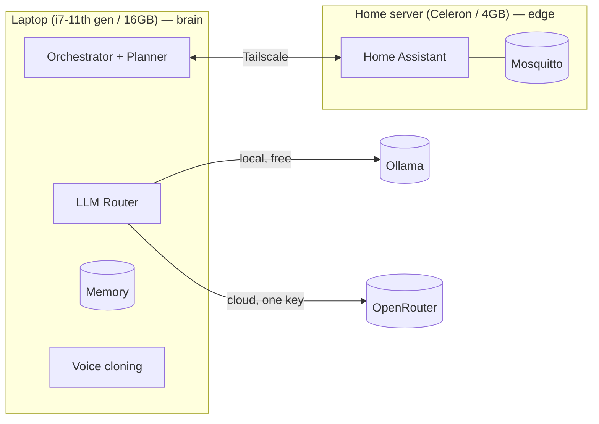

# Wajeeha AI

A personal, self-hosted AI assistant that plans, remembers, controls a
smart home, writes/runs code in a sandboxed workspace, and — soon — talks
back in a cloned voice.

Runs across two machines you already own instead of a single server:
a laptop does the thinking, a small home server does the always-on chores.



See [`deploy/DEPLOYMENT.md`](deploy/DEPLOYMENT.md) for the full two-node
setup (Tailscale, Docker Compose for the home server, systemd for the
laptop).

## What's here today

- **Brain** — LLM router (Ollama local + OpenRouter cloud, or Anthropic/
  OpenAI/Gemini directly) + a step-by-step planner + orchestrator
- **Memory** — short-term (in-process), long-term (SQLite), semantic
  (Chroma + sentence-transformers)
- **Coding agent** — sandboxed workspace, confirmation required before any
  write/destructive shell command
- **Home agent** — controls lights/switches/scenes and casts TTS
  announcements via Home Assistant (see the note in `agents/home_agent.py`
  on why Home Assistant, not a direct Google Home API)
- **Voice cloning** (`voice/clone.py`) — zero-shot clone from your own
  reference clips using Coqui XTTS-v2, runs on the laptop's CPU

## Not here yet

Vision, desktop control, a proper wake-word/always-listening loop, a
mobile app, and a real UI. The plan is to keep adding these as agents
behind the same orchestrator/tool-call interface the coding and home
agents already use.

## Quick start (single machine, for development)

```bash
python -m venv .venv
source .venv/bin/activate        # Windows: .venv\Scripts\Activate.ps1
pip install -r requirements.txt
ollama pull llama3.1
cp .env.example .env
```

`llm.default_provider` is `ollama` out of the box — free, local, no key
needed. Add `OPENROUTER_API_KEY` to `.env` and flip `default_provider` to
`openrouter` in `config/config.yaml` for stronger cloud models (any slug
from https://openrouter.ai/models). Home Assistant and voice are optional
and stay disabled until you configure them.

```bash
python cli.py chat                                          # interactive
python cli.py run "list the files in my workspace"          # one-shot
python cli.py speak "hello"                                 # voice (once configured)
pytest                                                       # test suite
```

## Full (two-node) deployment

Laptop runs all inference; home server runs Home Assistant, Mosquitto
(MQTT), and file sync, linked over Tailscale. Step-by-step in
[`deploy/DEPLOYMENT.md`](deploy/DEPLOYMENT.md).

## Layout

```
brain/     LLM router, planner, orchestrator
memory/    short-term, long-term (SQLite), semantic (Chroma) memory
agents/    base agent + coding agent + home agent + memory agent
voice/     voice cloning (Coqui XTTS-v2)
config/    config.yaml (behavior) + settings.py (typed loader)
deploy/    Docker Compose for the home server, systemd unit for the laptop,
           DEPLOYMENT.md
tests/     pytest suite
cli.py     entry point
```

## Notes

- **Home agent / Google Home Mini:** Google doesn't expose a general
  local-control API for the Home Mini. This agent talks to Home Assistant
  instead — full explanation in the comment block at the top of
  `agents/home_agent.py`. Disabled until `HOME_ASSISTANT_TOKEN` is set.
- **Local model quality:** `llama3.1` via Ollama is free but less reliable
  at following strict instructions than cloud models — very short/casual
  messages sometimes produce a weak response. Full sentences work better,
  and routing the planner specifically through OpenRouter is an easy fix
  if that becomes annoying.
