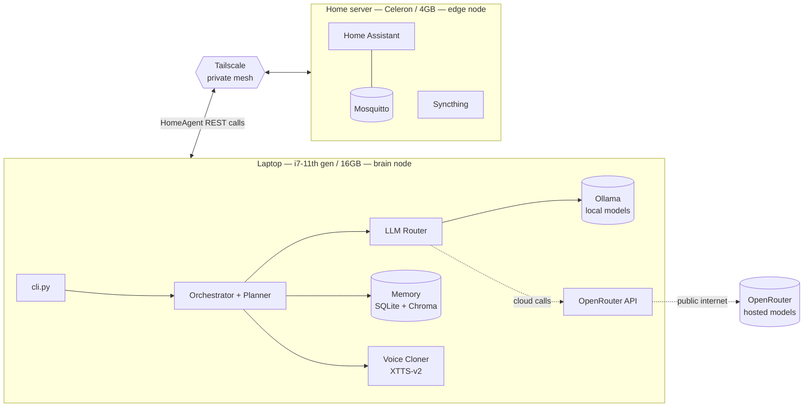

# Deployment: two-node setup

Wajeeha AI splits across two machines on the same Tailscale network:



## Why split it this way

- **All inference on the laptop.** 4GB on the Celeron isn't enough headroom
  for even a small local LLM alongside Home Assistant + MQTT; the i7/16GB
  laptop runs Ollama comfortably and has room for the voice model too.
- **Home Assistant + MQTT + Syncthing on the server** because they're
  lightweight, need to run 24/7 (the laptop won't), and are the things that
  actually need to sit near your home network / devices.
- **Tailscale connects them** so the laptop can reach Home Assistant's REST
  API from anywhere (home network, coffee shop, wherever) without exposing
  anything to the public internet, and without dealing with dynamic IPs or
  router port-forwarding.

## Home server setup

```bash
# 1. Tailscale (runs on the host, not in a container — see compose file comment)
curl -fsSL https://tailscale.com/install.sh | sh
sudo tailscale up

# 2. Docker
curl -fsSL https://get.docker.com | sh

# 3. Services
cd deploy/home-server
cp mosquitto/mosquitto.conf.example mosquitto/mosquitto.conf
# generate the MQTT password file, see comment inside mosquitto.conf.example
docker compose up -d

# 4. Note the Tailscale MagicDNS name for this box
tailscale status   # e.g. home-server.tailXXXX.ts.net
```

Then in Home Assistant's UI (first-run at `http://<server-tailscale-ip>:8123`):
set up whatever integrations you need, add the MQTT integration pointed at
`mosquitto:1883` (same Docker network) or `home-server:1883` from outside,
and generate a Long-Lived Access Token for `.env` on the laptop.

## Laptop setup

```bash
# 1. Tailscale
curl -fsSL https://tailscale.com/install.sh | sh   # or the Windows/macOS installer
sudo tailscale up

# 2. Ollama
curl -fsSL https://ollama.com/install.sh | sh       # or the Windows/macOS installer
ollama pull llama3.1

# 3. The app
git clone <your-repo-url> wajeeha-ai
cd wajeeha-ai
python -m venv .venv
source .venv/bin/activate      # Windows: .venv\Scripts\Activate.ps1
pip install -r requirements.txt
cp .env.example .env
```

Edit `.env`:
```
OPENROUTER_API_KEY=sk-or-...
HOME_ASSISTANT_TOKEN=<token from Home Assistant>
MQTT_PASSWORD=<password you set on the server>
```

Edit `config/config.yaml`: set `agents.home.home_assistant.base_url` and
`agents.home.mqtt.host` to the server's Tailscale MagicDNS name (from
`tailscale status` on the server, step 4 above).

Run it:
```bash
python cli.py chat
```

Optionally install `deploy/laptop/wajeeha.service` (see comments in that
file) so it survives reboots/logouts.

## Voice cloning

Once you have reference audio:
```bash
mkdir voice_samples
# drop 3-10 clean WAV/MP3 clips (10-30s each) of the target voice in there
```
Set `voice.enabled: true` in `config/config.yaml`, then:
```bash
python cli.py speak "Good morning, lights are on."
```
First run downloads the XTTS-v2 model (~1.8GB) — CPU inference on the i7 is
not real-time but is fast enough for a few-second reply.
